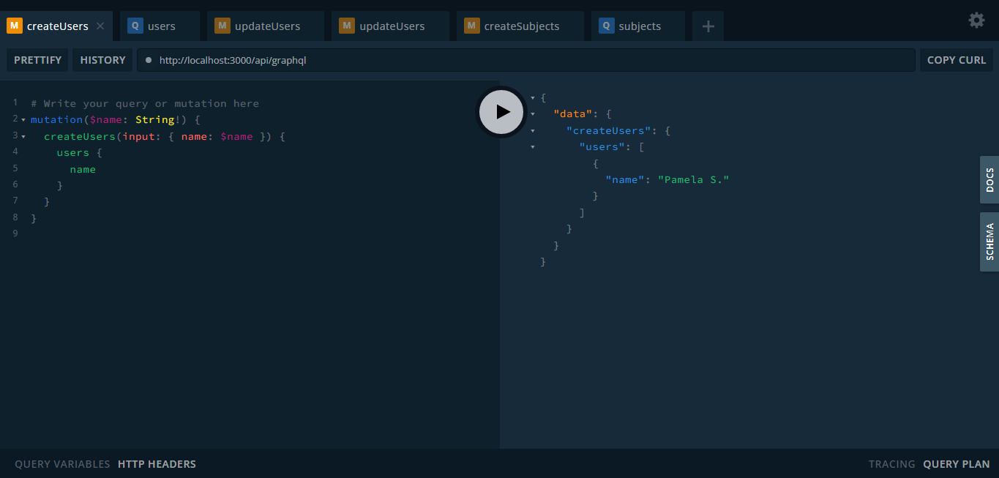
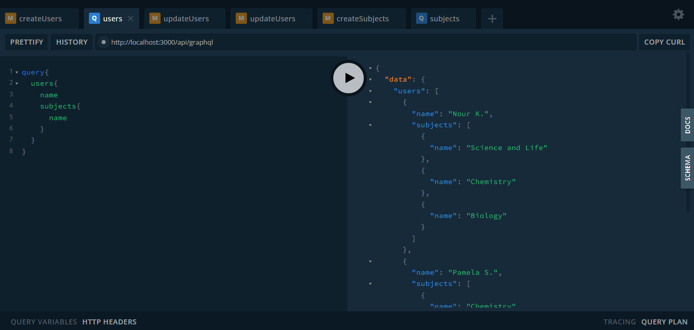
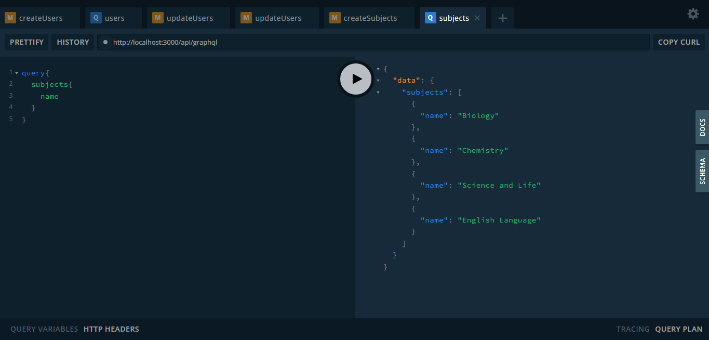

# Intoexpert-Graphql-Api

graphql api implementation

This project is implementing nextjs with graphql, and neo4j database with simple uiux.
To filter the resaults coming from database, its not the optimal solution but it just for test case.

To create Expert you can use this mutation

To get all Experts you can use this query

To get all Subjects you can use this query

